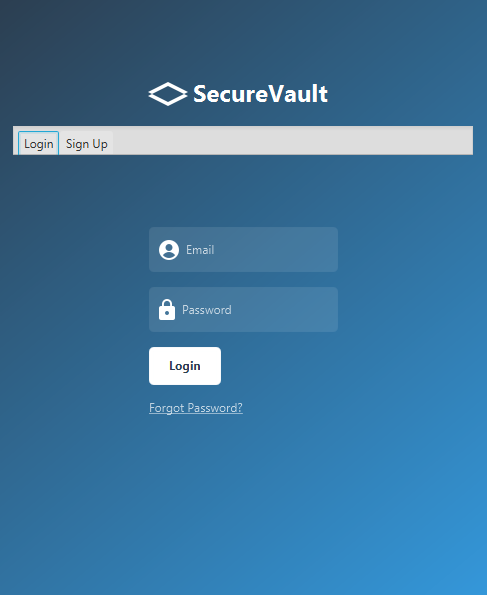
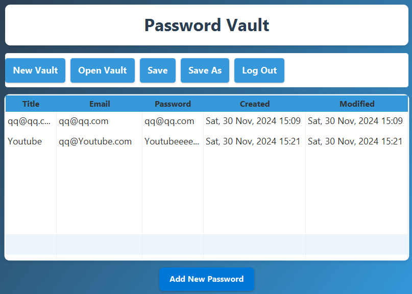

# Secure Vault App 🔐

## Overview

A secure Password Manager built with JavaFX, MySQL, and bcrypt to store, manage, and retrieve passwords for online accounts. This app provides an intuitive interface, ensuring user-friendly password management while leveraging encryption and hashing to safeguard sensitive information. 🔒

## Features 🌟

- **User Authentication**: Secure login using a username and password. 🛡️
- **Password Storage**: Add, edit, and remove password entries for different accounts. 💾
- **Password Encryption**: Encrypt passwords before storing them in the database for enhanced security. 🔑
- **Password Hashing**: Uses bcrypt to hash passwords before saving them to the database for extra protection. 🧑‍🔬
- **Search Functionality**: Easily search for specific accounts and view their details. 🔍
- **Secure Logout**: Log out safely to ensure data protection. 🚪

## Technologies Used 💻

- **JavaFX**: For building the graphical user interface (GUI). 🎨
- **MySQL**: For storing user data and encrypted passwords. 🗄️
- **Java**: The core programming language for the app. ☕
- **JDBC**: Java Database Connectivity to interact with the MySQL database. 🔗
- **Encryption**: AES encryption algorithm to secure stored passwords. 🔐
- **bcrypt**: For hashing and verifying passwords securely. 🔐🧠

## Screenshots 📸

